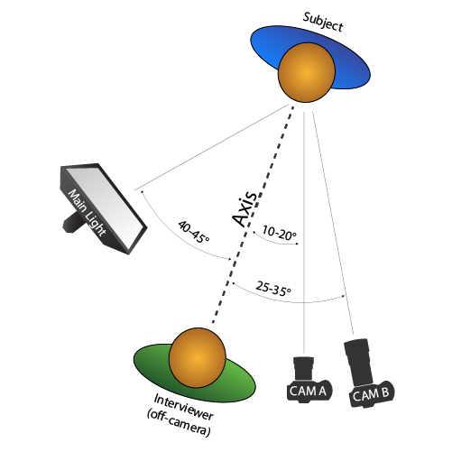
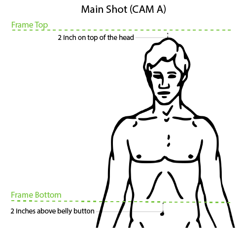
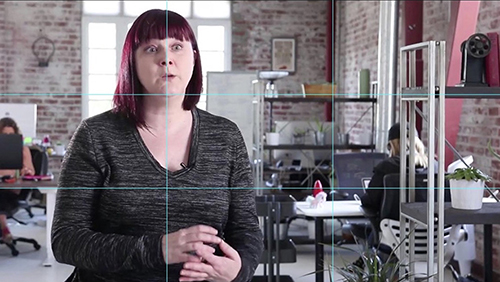
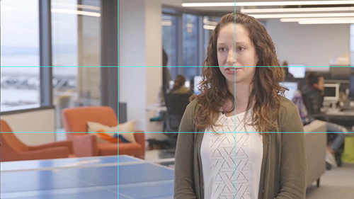
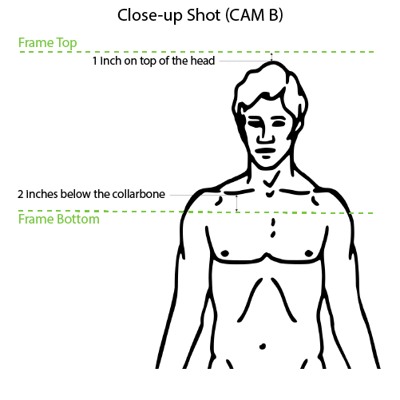
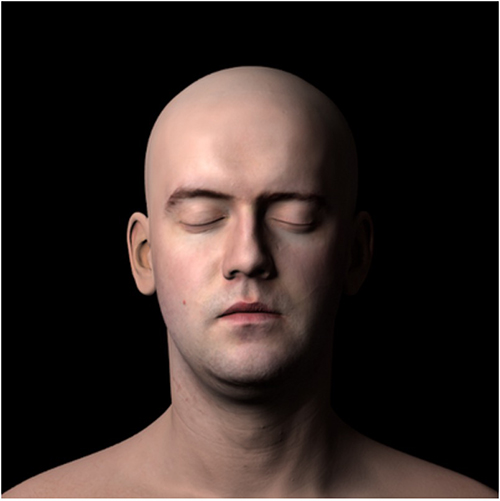
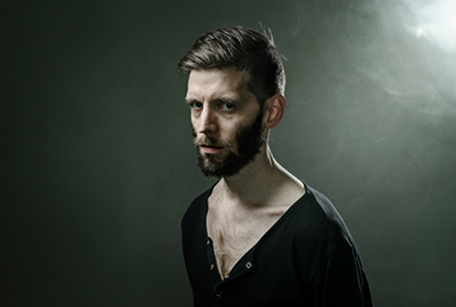
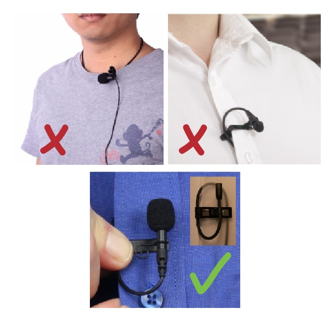
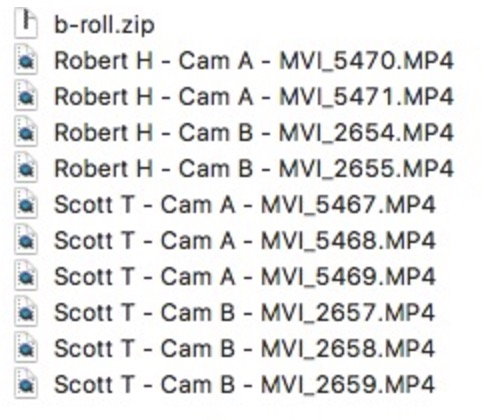

<link type="text/css" rel="stylesheet" href="./style.css" />

# Two-Camera Shoot Specs
V3: Updated: Sep 10th, 2017 by Tomas De Matteis.
These specs and instructions are applicable to any two-camera shoot, for example (Video 
Testimonial Template)

This templates consists of (2) parts: “the interview” and “company B-roll”.

In this document, we’ll refer to the person in front of the camera as “the subject”, Most of the times the subject is being interview by “the interviewer” who is off-camera.

----
## PART 01: Interview instructions

This interview will be recorded with (2) cameras.

### Both Cameras Settings:
- On the same video format and frame rate, FullHD 30p (or equivalent, but both cameras THE SAME)
- No Flat profile will be use. Cameras should have an equivalent exposure setting. (depending on the cameras this might mean that the exposure settings are not the exact same values. But the exposures, the amount of light is equivalent)
- Exposure should be "bright" but avoiding any 100% zebra (overexposure) areas on the subject. Some overexpose areas on background and windows is ok. But avoid full blown out windows right behind the subject.
- Both cameras need to have the same WB (preferable set in manual mode so that the same exact ####K can be set on both)
- Shutter speed should be, no slower than frame rate (30fps). Ideally double that 1/60
- ISO must be acceptable for the camera model. No noise should be visible to the eye.
- Focal length will be no smaller than 60mm (or Full-frame equivalent)

### Both Cameras Placement (diagram) 
Refer back to this diagram as you read the rest of the instructions about camera placement. It will all make sense.

- Camera is on tripod.
- Camera is at least 5 feet away from the subject.
- Camera is at the same height as the subject's eyes.
- Cam A (Main Shot) is 10-20° away from the axis.
- Cam B (Close-up Shot) is 25-35° away from the axis.

### Main Shot (CAM A)

#### CAM A - Shot Size
The Main Shot edges are 2 inches above the head up top and 2 inches above the belly button at the bottom.

#### CAM A - Shot Composition (rule of thirds)
The subject is positioned on one of the vertical third lines of the frame. (The line crosses their face between the eyes as seen on the examples)

If the subject is looking at the interviewer to the right of the camera then we will frame them in the left third.

If the subject is looking at the interviewer to the left of the camera then we will frame them in the right third.

### Close-up Shot (CAM B)

#### CAM B - Shot Size
This Shot is much tighter, the edges are 1 inch above the head up top and 2 inches below the collarbone at the bottom.

#### CAM B - Shot Composition (rule of thirds)
The subject is also being crossed by the vertical line of third, on the same side as in the main shot, whether that was left of right, it must be the same for both cameras. and both cameras are on the same side of the axis (see diagram).

### General Notes about Framing and Background.
- Try to avoid background lines crossing through the subject's head and/or neck.
- Check the background for messy or distractive elements that could be rearranged or removed.
- Avoid distinctive text in the background unless it's the company logo.
- Backgrounds with leading lines and depth are preferred to flat ones but only when it's possible without sacrificing other important things like good audio or lighting.

### Interview Lighting

#### Color temperature:
All lights that we add to the scene should match the color temperature of the available light in the scene, whether that's daylight or tungsten. If there is a lot of window light in the room we should use daylight lights if there are warm tungsten or fluorescent we should match that too. The objective is to avoid mixing color temperatures, even when that means turning the existing lights off or lowering the blinds.

#### Main Light

- This is a soft light, at 40-45° from the axis, on the opposite side of the axis as the cameras. ([see diagram above](#diagram))
- Both of the subject’s eyes are illuminated by this light.
- This light is at least one foot above subject's face.

>**Positioning tip:** You will know you are on the right angle when both cheeks receive light but not one of the ears. (Light ends right at the cheekbone)

#### Note on Natural Light:
Whenever possible it's preferable to use a window as our main light, provided that there is enough in the room to get the right exposure. And as long as there is no direct sunlight hitting the subject.

Using a window will demand that we arrange the position of subject and cameras according to the window.

Sometimes this is not possible, but we should always be aware of how light entering from a window is contributing to our shot and adjust accordingly.

#### Rim Light:

it's always useful to separate the subject from the background with a rim light located behind and above the subject, pointing right at the subject's hair and shoulders.

This light can be harder than the main light but make sure it doesn't hit the subject's cheek since the coming from this angle will highlight skin texture and imperfections (and we don't want that).

>**Tip:** If our rim light is very small, and we can't place it above the frame, sometimes it's best to hide it right behind the subject.

#### Fill Light:
It's always useful but not always necessary to place a white reflector on the opposite side of the subject as a fill light. the need for this will depend on the amount of ambient light and size of the room, as well as the color of the walls. In general, if the dark side is more than 3 or 4 stops lower than the bright side, it's good to bring it up a bit with a white reflector close enough to the face to bounce light from the main light but not so close that it enters our frame.

#### Other “Lighting” Tips and Advice
- Watch out for lights shining into the camera and creating glares or washing out the image.
- **Fluorescent Lights Warning:** Office fluorescent tubes and some other fluorescent lamps might cause <a href="https://www.youtube.com/watch?v=srQlxkdpLAs" target="_blank">flickering or banding</a> on our shot making it unusable. It's preferable to turn them off but if not possible, playing with the shutter speed of our cameras usually helps (multiples of 50 or 60 depending on when you are in the world)
- TVs might create a similar problem or introduce unnatural color casting on our subject, it's also best to turn them off if they are not in the frame.
- **Laptops and Other Devices:** If for some reason there is a laptop facing the subject (they may be reading from it) we need to make sure that we bring the “brightness” down low enough so there is no visible amount of light hitting our subject's face. Light coming from low angles is very unflattering.
- **Moving Vehicles** On rare occasions (but often enough to mention it), when shooting near a busy street in a room with big windows, the angle of the sun is just so that it will reflect in the windshield of cars passing by and enter our shot from a low angle. As artistic and dynamic as this might seem, it's very distracting on an interview shoot and we should try to avoid it, usually lowering the blinds is enough.

### The Subject (The person in front of the camera)
It's important to check how the person on camera looks before we start recording. Messy hair, sweaty/shiny skin, a reflection on their eye-glasses, a bra strap showing, a necklace in a strange position; these things may not render a shot obsolete but the subject might not like the way they look on camera because of it (and that's never a good thing).

- **Shiny Skin:** This is a common problem that we should look out for, specially after a while inside a room with filming lights, people can start to sweat. But sometimes we just have subjects with oily skin. No matter what the cause is we should be prepare and have tissues for the sweat and <a href="https://www.sephora.com/product/green-tea-blotting-linens-P61217?skuId=1164037&icid2=products%20grid:p61217" target="blank">Blotting liners</a> to offer then in case of oily skin. (Blotting liners are to be press in the different spots, and not rub.)

- **Posture:** Make sure the chair they are sitting in doesn't allow them to slouch. When possible always use one without a backrest or ask them to sit on the edge of the chair. If necessary, tell them.- _“I’m gonna ask you to please sit on the edge of the chair and not lean against the back, that will give you a better posture on camera.”_

- **Identifying the subjects:** It's your job to make sure that each subject that gets in front of the camera introduces themselves by saying their full name at the beginning of their first recorded interview. That way we can identify them in postproduction and add the correct nameplate. If you forget to ask them to do this at the beginning of the interview, please take a note of their name, you will need at least their first name when you are naming the files (more about this in the file naming section).

### The Interviewer
- Interviewer is also be at the same height as the subject, whether standing or seated.
- Be careful that the interviewer does not appear on the edge of the frame by accident. Or the paper/laptop he might be holding. A good trick to easily avoid this is to position them slightly farther away from the subject than the camera.

### Sound
- CAM A (Main Shot) has the main audio track that comes from a lavalier mic.
- Audio levels are adjusted accorded to the voice volume.
- If the camera in use allows it, it's best to record the same mic in both channels at different levels: one optimum and one slightly lower. In case the subject unexpectedly raises their voice.
- It's also a good practice to connect an ambient mic to the second camera in order to record backup audio. And even if an ambient mic is not available, the second camera MUST have an audio signal too, this “reference” audio track, even a bad quality audio like the internal camera mic audio, will allow us to sync the cameras in post-production.
- An external audio recorder closer to the subject is also a good redundancy measurement to ensure that no matter what, we have good audio.

#### Lavalier (“LAV”) Microphone Setup Tips:

- The microphone’s (“mic”) wire should be hidden underneath the subject's shirt/jacket. In case of a dress, sometimes it's best to hide the wire behind them and pass it under their arm or over the shoulder.

- It's important that the microphone capsule is not rubbing anything such as: skin, clothes, necklaces, etc. We should always position the clip so the capsule is on the outside (not touching anything) facing up toward the subject's mouth.

- It's also good to loop the wire once around the clip so that the weight of the wire doesn't pull the mic into a different angle. It's not necessary to hide the capsule from the camera; it's perfectly normal to see the mic in the shot. It's advisable to hide the hanging wire so it is not distracting, especially against a white shirt, but the capsule itself is perfectly ok.

## PART 02: B-Roll
Be creative, this is your time to shine and come out with great shoots that can illustrate what the subject was talking about or tell us more about them and their company in a visual way. You are going to capture at least %80 of this shots if not all using a tripod or slider.

### Some examples of b-roll shots that you can capture:
- Whenever the subjects have time for this, we want to make sure we capture images of them working, talking to colleagues, working on the computer (using the product), on the phone, walking around the office, writing on the whiteboard, etc 
- Building Establishing Shots
- Logo “on the wall” Shot
- Different rooms of the office in a pan or slide camera move.
- Static shot of a room with someone crossing the shot
- Details of decorations in the office/ company logo or merchandising
- People working: on the phone, talking to colleagues, on the phone, typing, coding, using mouse, drinking water, writing on paper or whiteboard, walking around the office.
- The subject talking to other people is always a plus. or even on the computer.
- Details related to the specific company or industry.
- Details of “people’s hands” while working
- Details of their eyes
- Camera “follows someone from behind” while they walk in the office.
- Same 2-3 people talking to each other from 2-3 different angles. (fin 2 or 3 different groups)

## Footage Upload:
In order to complete the project is your job to upload the footage to our platform within 24hs of the shoot being completed. Depending of your internet connection speed this might take several hours, so please have this in mind and start the upload process as soon as you can. You will receive an email with Upload credentials prior to the shoot.

### Footage organization:
We expect the footage to be organized and uploaded in the following way:

1- All the b-roll files (which are small but there’s many of them) should be inside a zip file named [b-roll.zip]
2- The files from the Interviews footage should be renamed like this:
	[subject’s name] - [Cam A/B] - [original file name]

Cam A for the "main shoot" and Cam B for the "close-up".

So if your original filename was

	MVI_1265.MP4

you should rename it to

	John D - Cam A - MVI_1265.MP4

The total list of files that you send us might look like this:

## Freedeographer Operations Contact Info
Tomas De Matteis, Head of Production, Tomas@FirstCut.io
Freedeographer Operations: Fops@Freedeo.io
